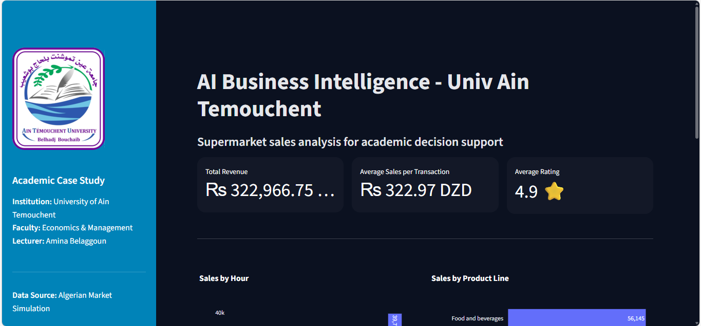
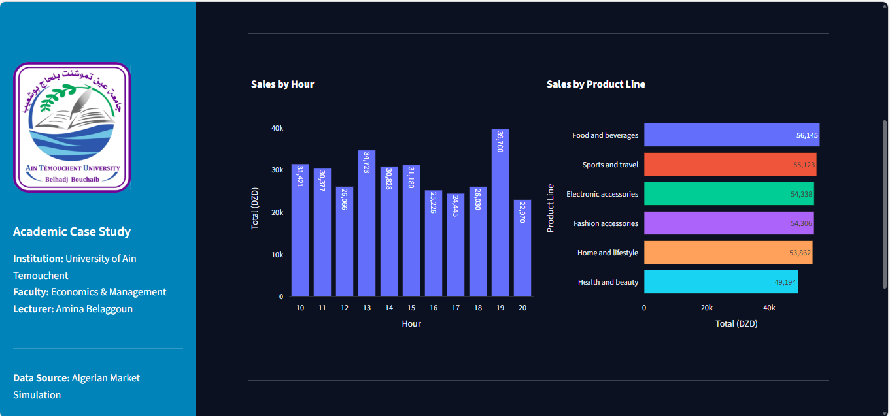
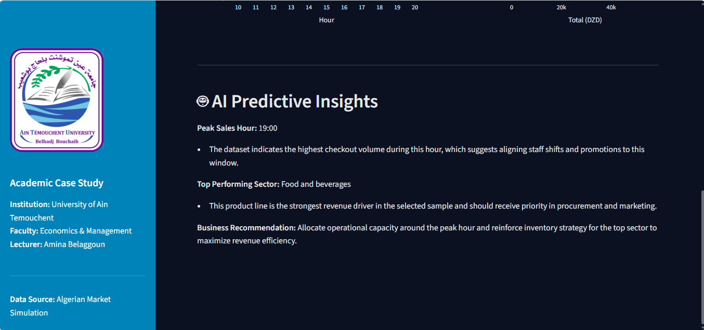

# 📊 AI-Driven Business Analytics Dashboard: Academic Case Study
### 🏛️ Faculty of Economics & Management Science - University of Ain Temouchent

[](https://www.python.org/)
[](https://streamlit.io/)
[](https://opensource.org/licenses/MIT)

This high-end Business Intelligence (BI) dashboard was developed as a primary instructional tool for the **Artificial Intelligence Module (Academic Year 2025-2026)**. It serves as a real-world demonstration of how AI-driven decision support systems can transform raw data into strategic insights within the Algerian economic landscape.

 ## 🚀 Live Demo
**[Click here to view the live dashboard](https://app-sales-dashboard-65nczq6jpczdynkqlgrsvw.streamlit.app/)**
---

## 🎓 Academic Context
As a **Visiting Lecturer** specializing in Artificial Intelligence, I designed this project to bridge the gap between theoretical data science and practical industry applications for Master 2 Management & Economics students.

- **Institution:** University of Ain Temouchent (Algeria).
- **Faculty:** Economics, Commercial, and Management Sciences.
- **Module:** Artificial Intelligence & Decision Support Systems.
- **Developer/Lecturer:** Amina Belaggoun.

---

## 🚀 Key Features
- **🌍 Regional Localization:** Fully adapted for the Algerian market with **DZD (Algerian Dinar)** currency and regional data (Ain Temouchent, Oran, Algiers).
- **🎨 Dark Luxe UI:** A custom-engineered, premium dark interface focusing on high-contrast typography and professional aesthetics.
- **🤖 AI Predictive Insights:** A specialized analytical layer that dynamically computes:
    - **Peak Sales Hour:** Identifying optimal operational timing.
    - **Top Growth Sector:** Predictive recommendations for resource allocation.
- **📈 Interactive KPIs:** Real-time tracking of Total Revenue, Average Transaction Value, and Customer Satisfaction Ratings.

---

## 📸 Project Showcase

### 1. Executive Dashboard & KPIs

*Real-time tracking of financial metrics and performance indicators formatted for the Algerian market.*

### 2. Market Segmentation Analysis

*Detailed visual breakdown of sales distribution by hour and product line performance.*

### 3. AI-Driven Decision Support

*The predictive insights section providing strategic recommendations based on historical data patterns.*

---

## 🛠️ Tech Stack
- **Backend/Logic:** Python 3.10+
- **Frontend/UI:** [Streamlit](https://streamlit.io/)
- **Data Engineering:** Pandas & Openpyxl
- **Data Visualization:** Plotly Express
- **Image Handling:** Pillow (PIL)

---

## 📦 Installation & Setup

1. **Clone the repository:**
   ```bash
   git clone [https://github.com/AminaDevApp/streamlit-sales-dashboard-main.git](https://github.com/AminaDevApp/streamlit-sales-dashboard-main.git)
   cd streamlit-sales-dashboard-main
Install dependencies:

Bash
pip install -r requirements.txt
Run the Application:

Bash
streamlit run app.py


🛡️ Professional Alignment
This project is an integral part of my professional portfolio, showcasing the intersection of Mobile Engineering (Flutter), Cybersecurity, and AI-driven Analytics. It reflects my commitment to building secure, scalable, and localized digital solutions for academic and industrial excellence.

Developer: Amina Belaggoun
Location: Ain Temouchent, Algeria.

📫 **Reach Me At:**
- **LinkedIn:** [linkedin.com/in/amina-belaggoun](https://www.linkedin.com/in/amina-belaggoun-2165972a2/)
- **Email:** [belaggounamina@gmail.com]
- **Portfolio:** [aminadevapp.netlify.app](https://aminadevapp.netlify.app/)
- **GitHub:** [@Blg-amina](https://github.com/Blg-amina)
